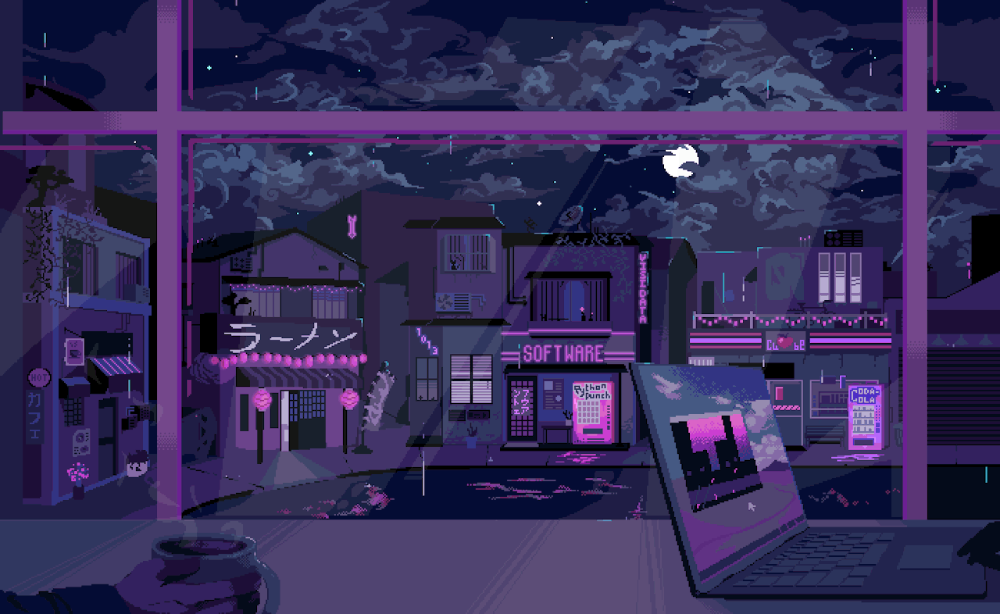

  

# Hi there 👋  
I'm [Tracy](https://portfolio-website-tracy-karanja.vercel.app/), glad to meet you. 

---

I'm a software engineer in the making with a passion for building sleek, user-friendly web apps. I'm currently pursuing my Master’s at [Carnegie Mellon University Africa](https://www.africa.engineering.cmu.edu/), where I'm honing both my technical chops and big-picture thinking. 🚀

From turning UI mockups into pixel-perfect interfaces to solving real-world problems with clean code, I love transforming ideas into functional, beautiful digital experiences.

> I believe tech should be both **impactful and delightful** — and I’m here for the magic in between.

- 💡 Curious about APIs, design systems, and React ecosystems  
- 👩🏽‍💻 I build with [React](https://reactjs.org/), [Next.js](https://nextjs.org/), [Tailwind](https://tailwindcss.com/), [Flask](https://flask.palletsprojects.com/) & more  
- 🛠 Check out my work on [GitHub](https://github.com/TracyK10) and [my portfolio](https://portfolio-website-tracy-karanja.vercel.app/)  
- 🧠 I write and share insights on [Hashnode](https://hashnode.com/@TracyK/) & [Medium](https://medium.com/@chirutracy)  
- 🌍 I’m all about tech that solves local problems and uplifts communities

Let's connect and create something awesome. ✨

## 🌟 Interests
- 👩‍💻 Tech enthusiast.
- 🤷‍♀️ Watching movies and series.
- 🖥 Programming and problem solving.
## 🗣 Languages
I'm currently learning
- 🤖 Python
- 🚀 Javascript
- 📌 HTML/CSS
- ⚛️ React JS
- 🌐 APIs
- ♾ Next JS
- 🌶 Flask
- 🅱 Bootstrap
- 🔷 Tailwind
- 📲 React Native together with Expo
## 💬 Contact Me
You can contact me on email: chirutracy@gmail.com or using the following links below: 👇🏽👇🏽👇🏽

  

  
  

   

## ⏱ Github Stats  

  

   

## 💭 Here's a random quote for you

  

## 🤝 Collaborate
I'm open to collaborating on projects and working together. Feel free to reach out.

